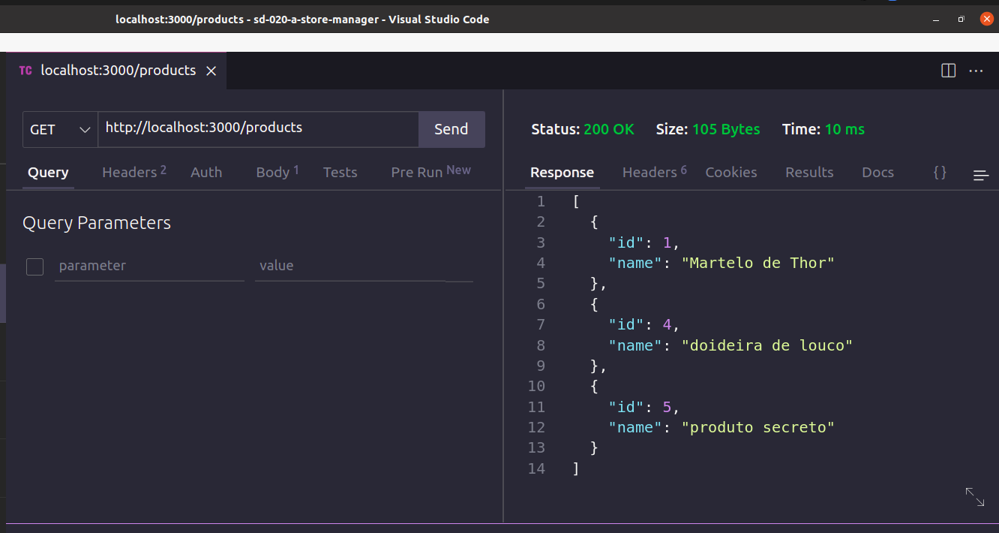
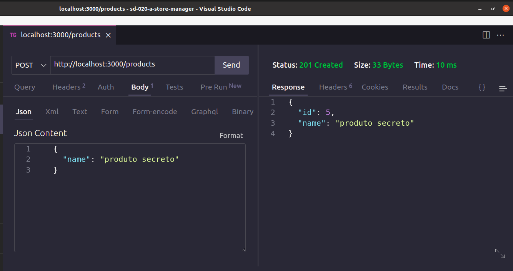
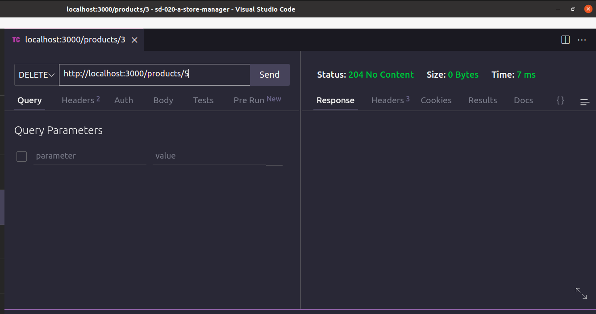
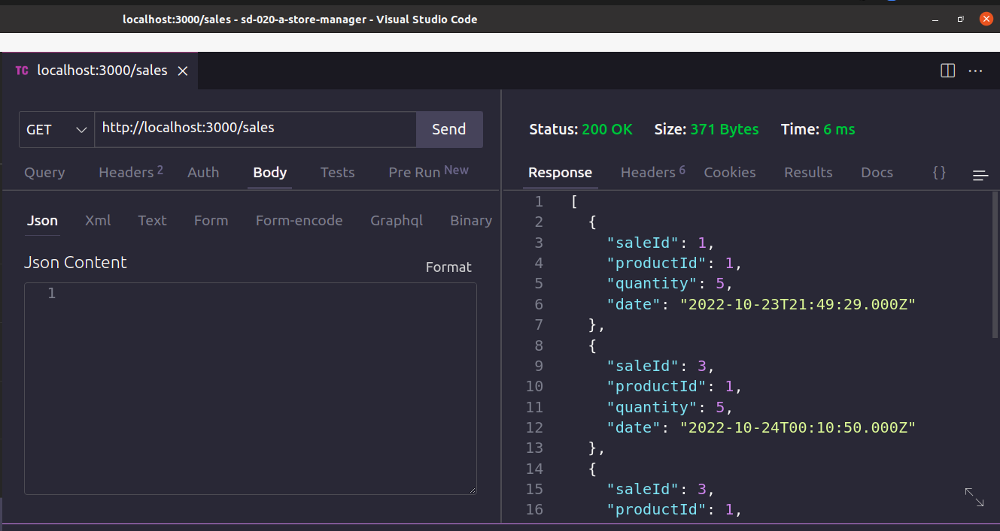
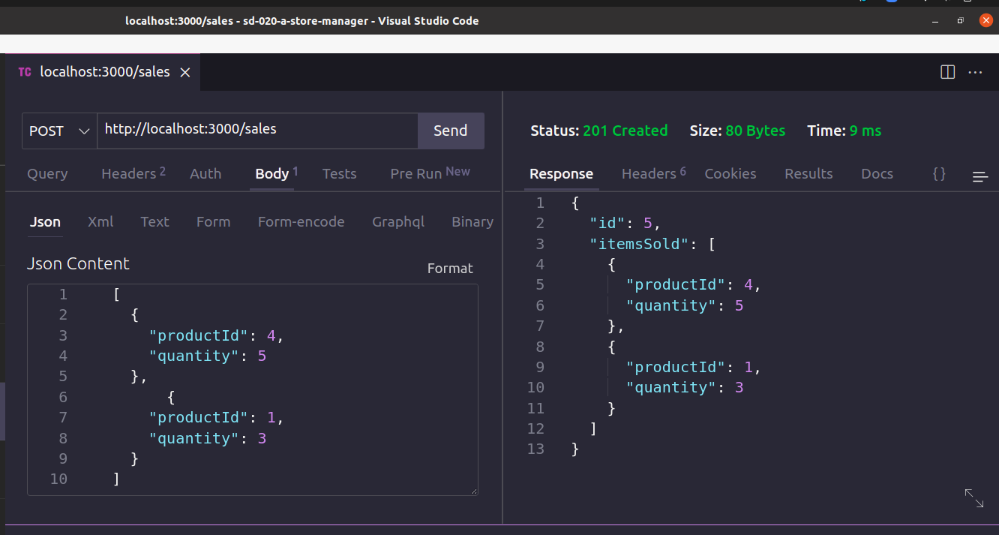
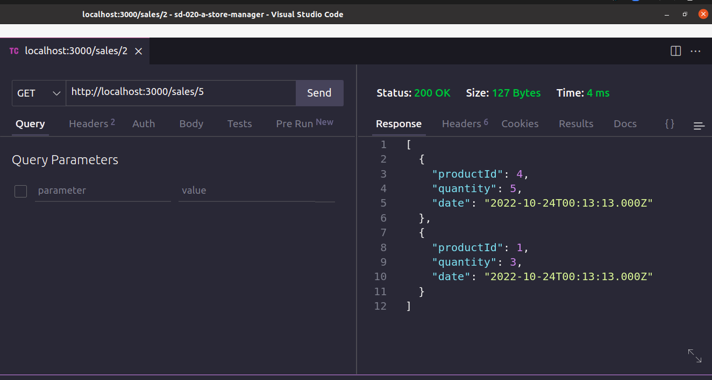

# Store Manager 🛍️

This Project creates a RESTful API using the MSC (model-service-controller) architecture!

The API is a sales management system in the dropshipping format. It is possible to create, visualize and delete products and sales.

<strong>First commit:</strong> on Aug 11, 2022.

<strong>Here I had to exercise:</strong> MSC, Node.js, Express, MySQL, docker.

This is a back-end Project, part of my course at [Trybe](https://www.betrybe.com/).


<details>
 <summary><strong>📸 Endpoints Results Screenshots:</strong></summary><br />

GET /products </br>


POST /products </br>


DELETE /products/:id </br>


GET /sales </br>


POST /sales  </br>


GET /sales/:id </br>


 </details>


# How to run it:

<details>
 <summary><strong> You need to have installed:</strong></summary><br />
 - Unix based Operational System <br />
 - node version >= 16.14.0 LTS <br />
 - Docker <br />
 - Docker-compose version >= 1.29.2 <br />
</details>
 

command: `npm install` <br />
Use Docker, command: `npm run compose:up`

# Files/Folders Ownership

Here you find a list of files and or folders according to the ownership.

<details>
 <summary><strong>🙋‍♀️ I coded myself:</strong></summary><br />
   
  ```markdown  
  app/
    backend/
      src/ 
        controllers/
        database/
          migrations/ (except 99999999999999-create-z.js)
          Models/ (except ExampleModel.ts & index.ts)
        helpers/
        interfaces/
        middlewares/ (except error.middleware.ts)
        routes/
        services/
        tests/
      Dockerfile
    frontend/
      Dockerfile
      packages.npm
  README.md
  ```
 
 </details>


<details>
 <summary><strong>🧑‍🤝‍🧑 I coded partially - the scholl has coded some of it:</strong></summary><br />
 
 ```markdown   
  app/
    backend/
      src/
        app.ts
 ```
 
 </details>


<details>
 <summary><strong>🧛 coded by a teacher or a teammate:</strong></summary><br />
   
 ```markdown  
  app/
    backend/
      helpers/
        BcryptService.ts -> ref. school class code
      middlewares/
        error.middleware.ts -> ref. school classes material and project revision class code
  ```
 
 </details>

<details>
 <summary><strong>🏫 coded by the school:</strong></summary><br />
   
  ```markdown  
   all others not mentioned before.
  ```
 
 </details>
 
 #

✨ all icons used here are from:  [EmojiPedia](https://emojipedia.org/). 

#### 🚧 README under construction 🚧
<!--

-->


